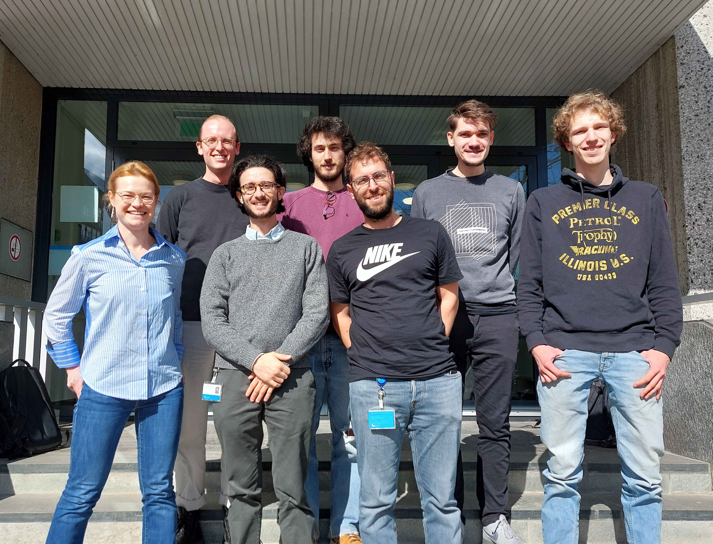

The group
===============================

**The group is moving to the University of Oxford. Apply now for a [PhD](https://www.ox.ac.uk/admissions/graduate/courses/dphil-theoretical-physics) and [postdoc](https://my.corehr.com/pls/uoxrecruit/erq_jobspec_version_4.display_form?p_company=10&p_internal_external=E&p_display_in_irish=N&p_process_type=&p_applicant_no=&p_form_profile_detail=&p_display_apply_ind=Y&p_refresh_search=Y&p_recruitment_id=182903) positions**

**Graduate students:**

Jose Soto Garcia 

Bowy La Riviere

Julien Fitouchi
 
Pietro Richelli

Warre Missiaen

**Undergraduate students:**

Luka van der Heiden

Filip Sfetcu

Ioannis Angelo Tassioulas 

**Former group members:**

Jesse van der Kooi

Daan van der Veer

Niels Pronk

Rik Mulder (continues his studies at TUDelft)

Bernhard Lüscher (now a PhD student at the University of Zurich)

### **News**

06/11/2025 I was a keynote at the [Øredev 2025](https://oredev.org/) Developers conference in Sweden 

15/10/2025 Warre Missiaen joins the group

01/10/2025 The group will be moving to the [University of Oxford](https://www.physics.ox.ac.uk/news/department-physics-welcome-dr-chepiga)

04/09/2025 I was awarded the ERC-StG grant

01/08/2025 Ioannis Angelo Tassioulas and Filip Sfetcu join the group

19/03/2025 Niels Pronk successfully defended his thesis

21/10/2024 Bowy's paper has been accepted by [SciPost Physics](https://scipost.org/submissions/2406.20093v2/)

09/09/2024 Jose's paper has been published in [PRB](https://journals.aps.org/prb/abstract/10.1103/PhysRevB.110.125113)

06/2024 Niels Pronk joins the group

01/05/2024 I joined APS as an Associate Editor of [PhysRevResearch](https://journals.aps.org/prresearch/staff)

23/01/2024 My paper on Tunable quantum phase transitions has been published in [PRL](https://journals.aps.org/prl/abstract/10.1103/PhysRevLett.132.076505)

05/01/2024 Our paper with Nicolas Laflorencie on Resilient infinite randomness in Majorana chains has been published in [PRL](https://journals.aps.org/prl/abstract/10.1103/PhysRevLett.132.056502)

01/01/2024 Pietro Richelli and Julien Fitouchi join the group

11/12/2023 I was awarded a research grant by [Julian Schwinger Foundation (USA)](https://schwingerfoundation.org/awardedgrants.php)

29/11/2023 Kenna Hughes-Castleberry wrote an article about my research for [“Women of Quantum Technology”](
https://www.insidequantumtechnology.com/news-archive/women-of-quantum-technology-dr-natalia-chepiga-of-delft-university-of-technology/)

19/10/2023 Our paper with Bernhard Luescher is published in [PRB](https://journals.aps.org/prb/abstract/10.1103/PhysRevB.108.184425)

17/10/2023 Bowy won a poster prize at the international workshop "Tensor Network for Constrained systems", The Netherlands

29/09/2023 Jose won a poster prize at the Fall School "Topological Quantum Matter", Germany

07/02/2023 I got IQTN funding for the workshop "Tensor Network for Constrained systems"

01/01/2023 I was awarded a visiting professorship at CNRS, Toulouse

15/03/2022 Bowy La Riviere joins the group

15/11/2021 I was awarded [Minerva prize](https://dutchphysicscouncil.nl/613-4/)

01/11/2021 Jose Soto Garcia joins the group

01/01/2021 I join the [European Tensor Network](https://nextcloud.tfk.ph.tum.de/etn/)

### **Visit us**

**Delft University of Technology**

Room: E 122/124 

Kavli Institute of Nanoscience,  **Applied Sciences 22**,

Lorentzweg 1, 2628 CJ Delft,  The Netherlands

