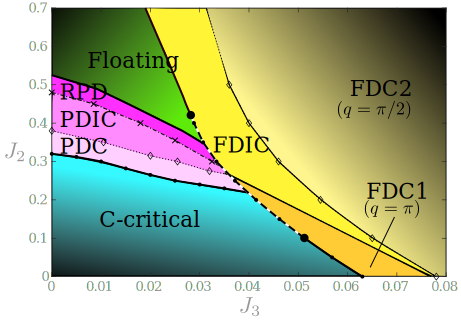

Natalia Chepiga
===============

### Postal address:

University of Amsterdam

Institute for Theoretical Physics

Science Park 904

Postbus 94485

1090 GL Amsterdam

The Netherlands

Email: natalia.chepiga@alumni.epfl.ch

### Inspiration

Floating, critical and dimerized phases in a frustrated spin-3/2 chain

