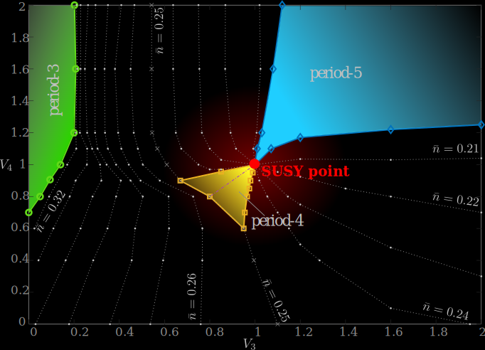
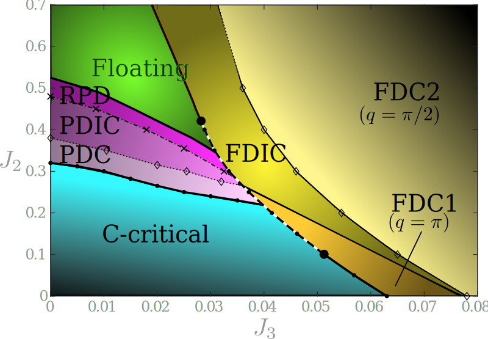
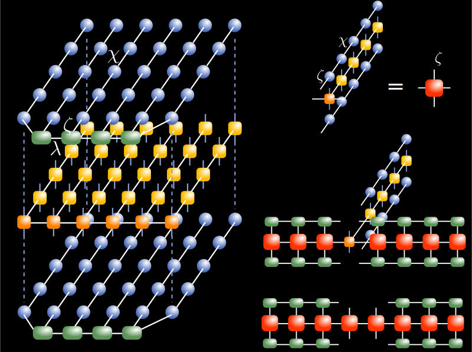

Natalia Chepiga
===============

Email: n.chepiga@tudelft.nl

[CV](https://nchepiga.github.io/homepage/assets/CV.pdf) and
[GoogleScholar](https://scholar.google.ch/citations?user=oktle5oAAAAJ&hl=de&oi=ao)

ORCID iD: [0000-0002-5313-5035](https://orcid.org/0000-0002-5313-5035)

**Openings**
============

PhD and postdoc positions are currently available in my newly established group on Computational Quantum Many-Body Physics at TUDelft.
The group will focus on a **development of tensor network algorithms and applications** to:

- Exotic quantum phase transitions;   
- Quantum magnetism;   
- Rydberg atoms and systems with unconventional Hilbert space in and out of equilibrium;   
- Quantum scars and constrained dynamics;   
- Supersymmetry.   

I am primary looking for candidates with strong numerical background, but excellent candidates with expertise in other areas of condensed matter theory will also be considered. Applications should be sent by e-mail and contain an academic CV including list of publications, the (provisional) title of the PhD/Master thesis, a motivation letter, and the contact information of two referees.
Applications will be considered until all positions are filled.

### Postal address:

**Delft University of Technology**

Department of Quantum Nanoscience, 
Kavli Institute of Nanoscience, 
Faculty of Applied Sciences, 
Lorentzweg 1, 2628 CJ Delft, 
The Netherlands

Inspiration
===========

### **Chiral transitions in chains of Rydberg atoms**

[Video seminar](https://www.youtube.com/watch?v=zOzUTW-IZoE&t=955s), 
[Nature Communications](https://www.nature.com/articles/s41467-020-20641-y) and 
[PRL](https://journals.aps.org/prl/abstract/10.1103/PhysRevLett.122.017205)

### **Supersymmetry and multicriticality in constrained fermions**

[preprint](https://arxiv.org/abs/2105.04359)

### **Floating phase in a spin-3/2 chain**

[paper](https://arxiv.org/abs/2002.08982) 

### **Conformal Towers with DMRG**

[paper](https://arxiv.org/abs/1705.05423) and 
[another one](https://arxiv.org/abs/1603.01395)

### **Solitons in spin-1 chain**

[paper](https://arxiv.org/abs/1608.08109) and 
[another one](https://arxiv.org/abs/1910.03064)

### **Comb tensor networks**

[paper](https://arxiv.org/abs/1903.00432) and 
[another one](https://arxiv.org/abs/2002.11405v1)

