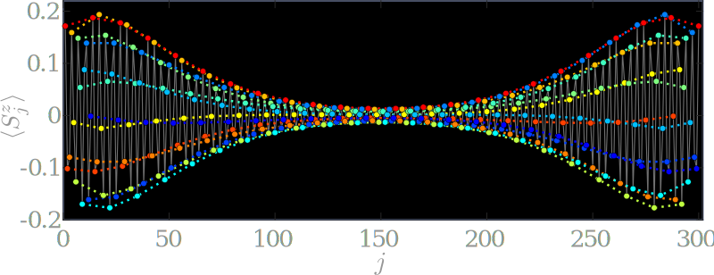

Natalia Chepiga
===============

Email: natalia.chepiga@alumni.epfl.ch

[[CV]](https://nchepiga.github.io/homepage/assets/CV.pdf) and
[GoogleScholar](https://scholar.google.ch/citations?user=oktle5oAAAAJ&hl=de&oi=ao)

ORCID iD: [0000-0002-5313-5035](https://orcid.org/0000-0002-5313-5035)

**Openings**
============

PhD and postdoc positions are currently available in my newly established group on Quantum Many-Body Physics at TUDelft.
The group will focus on a development of tensor network algorithms and applications to:

- Quantum magnetism;   
- Rydberg atoms and systems with unconventional Hilbert space in and out of equilibrium;   
- Exotic quantum phase transitions;   
- Quantum scars and related topics;   
- Supersymmetry.   
If you are interested in joining the group contact me by e-mail. 
Soft deadline is January 31 2021, but later applications will be considered until all positions are filled.

### Postal address:

**University of Amsterdam**

Institute for Theoretical Physics,
Science Park 904, 
Postbus 94485, 
1090 GL Amsterdam, 
The Netherlands 

### From 1 January 2021:

**Delft University of Technology**

Faculty of Applied Sciences, 
Kavli Institute of Nanoscience, 
Department of Quantum Nanoscience, 
Lorentzweg 1, 
2628 CJ Delft, 
The Netherlands

Inspiration
===========

### **Chiral transitions in chains of Rydberg atoms**

[Video seminar](https://www.youtube.com/watch?v=zOzUTW-IZoE&t=955s), 
[paper](https://arxiv.org/abs/1808.08990) and 
[another one](https://arxiv.org/abs/2001.06698)

### **Floating phase in a spin-3/2 chain**

[paper](https://arxiv.org/abs/2002.08982) 

### **Conformal Towers with DMRG**

[paper](https://arxiv.org/abs/1705.05423) and 
[another one](https://arxiv.org/abs/1603.01395)

### **Solitons in spin-1 chain**

[paper](https://arxiv.org/abs/1608.08109) and 
[another one](https://arxiv.org/abs/1910.03064)

### **Comb tensor networks**

[paper](https://arxiv.org/abs/1903.00432) and 
[another one](https://arxiv.org/abs/2002.11405v1)

