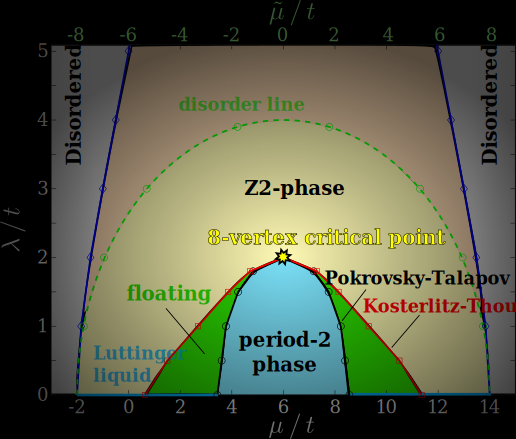

Natalia Chepiga
===============

Email: n.chepiga@tudelft.nl

[CV](https://nchepiga.github.io/homepage/assets/CV.pdf) and
[GoogleScholar](https://scholar.google.ch/citations?user=oktle5oAAAAJ&hl=de&oi=ao)

ORCID iD: [0000-0002-5313-5035](https://orcid.org/0000-0002-5313-5035)

[**Delft Many-Body Workshop Series**](https://nchepiga.github.io/homepage/workshop)
============

Next workshop: [Tensor networks for constrained systems, 16-18 October 2023](https://iqtn.phys.strath.ac.uk/tensor-networks-for-constrained-systems/)

**The group**
============

PhD position is available. If you are interested contact me by e-mail.

**Research**
===========

### **Critical properties of the Majorana chain**

[Paper](https://doi.org/10.1103/PhysRevB.108.054509)

### **Floating phase without doping: new surprises from the old model**

[Paper](https://journals.aps.org/prresearch/abstract/10.1103/PhysRevResearch.4.043225)

### **5, 3, 1... The odd sequence of WZW criticalities in spin-5/2 chain**

[paper](https://journals.aps.org/prb/abstract/10.1103/PhysRevB.105.174402)

### **Chiral transitions in chains of Rydberg atoms**

[Video seminar](https://www.youtube.com/watch?v=zOzUTW-IZoE&t=955s), 
[Nature Communications](https://www.nature.com/articles/s41467-020-20641-y),
[PRL](https://journals.aps.org/prl/abstract/10.1103/PhysRevLett.122.017205)  and 
[the new preprint](https://arxiv.org/abs/2203.01163)

### **Boundary CFT and duality in 3- and 4-state Potts models**

[paper](https://scipost.org/SciPostPhysCore.5.2.031/pdf)

### **Supersymmetry and multicriticality in constrained fermions**

[paper](https://scipost.org/10.21468/SciPostPhys.11.3.059)

### **8-vertex criticality in the interacting Kitaev chain**

[preprint](https://arxiv.org/abs/2206.11754)

### **Floating phase in spin-3/2 chain**

[paper](https://arxiv.org/abs/2002.08982) 

### **Conformal Towers with DMRG**

[paper](https://arxiv.org/abs/1705.05423) and 
[another one](https://arxiv.org/abs/1603.01395)

### **Solitons in spin-1 chain**

[paper](https://arxiv.org/abs/1608.08109) and 
[another one](https://arxiv.org/abs/1910.03064)

### **Comb tensor networks**

[paper](https://arxiv.org/abs/1903.00432) and 
[another one](https://arxiv.org/abs/2002.11405v1)

### Postal address:

**Delft University of Technology**

Department of Quantum Nanoscience, 
Kavli Institute of Nanoscience, 
Faculty of Applied Sciences, 
Lorentzweg 1, 2628 CJ Delft, 
The Netherlands

