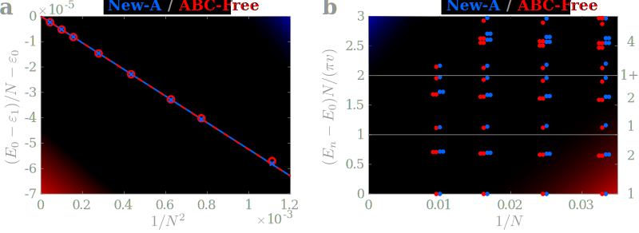

Natalia Chepiga
===============

Email: n.chepiga@tudelft.nl

[CV](https://nchepiga.github.io/homepage/assets/CV_Chepiga.pdf) and
[GoogleScholar](https://scholar.google.ch/citations?user=oktle5oAAAAJ&hl=de&oi=ao)

ORCID iD: [0000-0002-5313-5035](https://orcid.org/0000-0002-5313-5035)

[**Delft Many-Body Workshop Series**](https://nchepiga.github.io/homepage/workshop)
============

next workshop: [Synthetic Quantum Matter, Aug 27-28 2025](https://nchepiga.github.io/homepage/workshop)

[**The group / News**](https://nchepiga.github.io/homepage/group)
============

**We are hiring!** If you are interested in joining the group contact me by e-mail.

**physicist/mom**
============

**Research**
===========

### **Wess-Zumino-Witten transitions in a frustrated spin-3 chain**

[Pre-print](https://arxiv.org/pdf/2402.05031.pdf)

### **Tunable quantum criticality in Rydberg atoms**

[Paper](https://journals.aps.org/prl/accepted/6207cY47Wd410f8442008bd42da36a9eae44c216a) and the [pre-print](https://arxiv.org/pdf/2308.12838.pdf) and the paper on [the chiral Ashkin-Teller model](https://journals.aps.org/prb/abstract/10.1103/PhysRevB.108.184425)

### **Critical properties of the Majorana chain**

[PRL](https://journals.aps.org/prl/accepted/5907eY27Sd01be87d79a48c1f5c1004c1fabb14a9)
and [PRB](https://doi.org/10.1103/PhysRevB.108.054509)
and [SciPost](https://scipost.org/10.21468/SciPostPhys.14.6.152)

### **Floating phase without doping: new surprises from the old model**

[Paper](https://journals.aps.org/prresearch/abstract/10.1103/PhysRevResearch.4.043225)

### **5, 3, 1... The odd sequence of WZW criticalities in spin-5/2 chain**

[paper](https://journals.aps.org/prb/abstract/10.1103/PhysRevB.105.174402)

### **Chiral transitions in chains of Rydberg atoms**

[Video seminar](https://www.youtube.com/watch?v=zOzUTW-IZoE&t=955s), 
[Nature Communications](https://www.nature.com/articles/s41467-020-20641-y),
[PRL](https://journals.aps.org/prl/abstract/10.1103/PhysRevLett.122.017205)  and 
[PRR](https://journals.aps.org/prresearch/abstract/10.1103/PhysRevResearch.4.043102)

### **Boundary CFT and duality in 3- and 4-state Potts models**

[paper](https://scipost.org/SciPostPhysCore.5.2.031/pdf)

### **Supersymmetry and multicriticality in constrained fermions**

[paper](https://scipost.org/10.21468/SciPostPhys.11.3.059)

### **Conformal Towers with DMRG**

[paper](https://arxiv.org/abs/1705.05423) and 
[another one](https://arxiv.org/abs/1603.01395)

### **Solitons in spin-1 chain**

[paper](https://arxiv.org/abs/1608.08109) and 
[another one](https://arxiv.org/abs/1910.03064)

### **Comb tensor networks**

[paper](https://arxiv.org/abs/1903.00432) and 
[another one](https://arxiv.org/abs/2002.11405v1)

### Postal address:

**Delft University of Technology**

Department of Quantum Nanoscience, 
Kavli Institute of Nanoscience, 
Faculty of Applied Sciences, 
Lorentzweg 1, 2628 CJ Delft, 
The Netherlands

