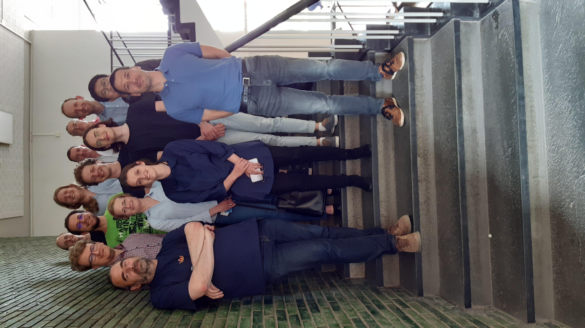
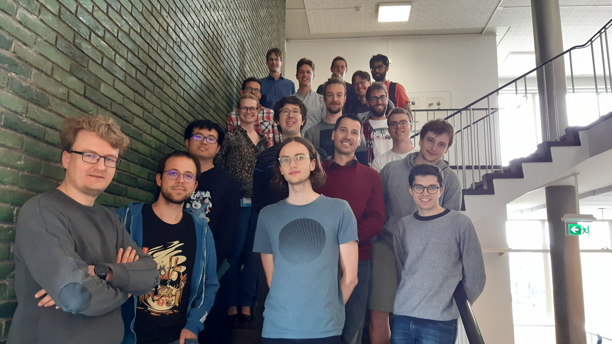
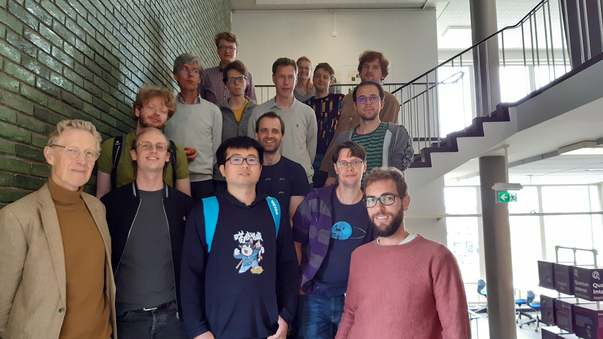

Delft Many-Body Workshop Series
===============================

Understanding collective phenomena in strongly correlated quantum many-body systems is one of the biggest challenges in modern condensed matter physics. Development of efficient computational methods and conformal field theory topped up with the recent progress on cold atoms experiments make the study of low-dimensional strongly correlated systems one of the hottest topics in the field. The goal of this workshop series is to bring together local experts working on various aspects of quantum many-body theory to regenerate the network of scientific connections and to stimulate new collaborations in the area.

### **Upcoming workshops** 

**Symmetry and Duality in Quantum Many-Body Systems**

[Registration form](https://forms.gle/Xjykg7ifk56kxWeM6) 

List of invited speakers:

**October 12 at TUDelft**

9:30-10:00 (Coffee+)Arrival

10:00-11:00 Kareljan Schoutens (Amsterdam)

11:10-11:55 Hosho Katsura (Tokyo)

Duality, criticality, and topology in quantum spin-1 chains

12:00-13:00 Lunch

13:00-14:00 Frank Verstraete (Ghent)

14:05:14:50 Jutho Haegeman (Ghent)

14:50-15:30  Coffee

15:30-16:15 Pieter Claeys(Dresden)

16:20-16:45 Emanuele Di Salvo (Utrecht)

Quantum quenches in the sinh-Gordon and Lieb-Liniger models

**October 13 at UGhent**

9:30-10:00 (Coffee+)Arrival

10:00-10:45 Laurens Lootens (Ghent)

10:50-11:50 Jean-Sébastien Caux (Amsterdam)

12:00-13:00 Lunch

13:00-14:00  Ian McCulloch (Queensland)

14:05:14:50 Natalia Chepiga (Delft)

Dual boundary conditions in minimal models

14:50-15:30  Coffee

15:30-16:15 Clement Delcamp (Ghent)

16:20-16:45 Juan Arias (Amsterdam)

Quantum Information Scrambling in Systems with Nonlocal Interactions

### **Location**

**Delft University of Technology**

Room: F 206 and F 461.1/2 

Kavli Institute of Nanoscience,  **Applied Sciences 22**,

Lorentzweg 1, 2628 CJ Delft,  The Netherlands

### **Past workshops**

**June 2nd**

Speakers: Vladimir Gritsev (UvA); Dirk Schuricht (UU); Sander Otte (TUDelft); Jiri Minar (UvA); Denise Ahmed-Braun (TUE); Lieuwe Bakker (UvA); Jyong-Hao Chen (Leiden); 

**May 31st**

Speakers: Philippe Corboz (UvA); Jordi Tura Bruguez (Leiden); Lars Fritz (UU); Juraj Hasik (UvA); Maarten Van Damme (UGent); Boris Ponsioen (UvA)

**May 25th**

Speakers: Kareljan Schoutens (UvA, QuSoft); Laurens Vanderstraeten (UGent); Lieven Vandersypen (TUDelft); Mikael Fremling (UU); Misha Isachenkov (UvA); Onno Huijgen (Radboud)

[Download programs](https://nchepiga.github.io/homepage/assets/program_workshops.pdf)

### **List of Prticipants**

Jordi Tura Brugues (Leiden)

Philippe Corboz (UvA)

Mikael Fremling (UU)

Lars Fritz (UU)

Vladimir Gritsev (UvA)

Juraj Hasik (UvA)

Bernard Nienhuis (Leiden)

Jiri Minar (UvA)

Sander Otte (TUDelft)

Kareljan Schoutens (UvA, Qusoft)

Dirk Schuricht (UU)

Laurens Vanderstraeten (UGent)

Lieven Vandersypen (TUDelft)

Denise Ahmed-Braun (TU Eindhoven)

Juan Diego Arias Espinoza (UvA)

Lieuwe Bakker (UvA)

Evgenii Barts (Groningen)

Yaroslav Blanter (TUDelft)

Liam Bond (UvA)

Mert Bozkurt (TUDelft)

Lander Burgelman (UGent)

Maarten van Damme (UGent)

Jyong-Hao Chen (Leiden)

Lukas Devos (UGent)

Emanuele Di Salvo (UU)

Ivo Gabrovski (Groningen)

Yaroslav Herasymenko (TUDelft, QuSoft)

Onno Huijgen (Radboud)

Rui-Zhen Huang (UGent)

Daan Maertens (UGent)

Antonio Manesco (TUDelft)

Misha Isachenkov (UvA)

Bowy La Riviere (TUDelft)

Sebastian Miles (TUDelft)

Boris Ponsioen (UvA)

Stephan Plugge (Leiden)

Artem Pulkin

Mykola Semenyakin (Leiden)

Jose Soto (TUDelft)

Ward Vleeshouwers (UvA)

Xin Zhang (QuTech, TUDelft)

