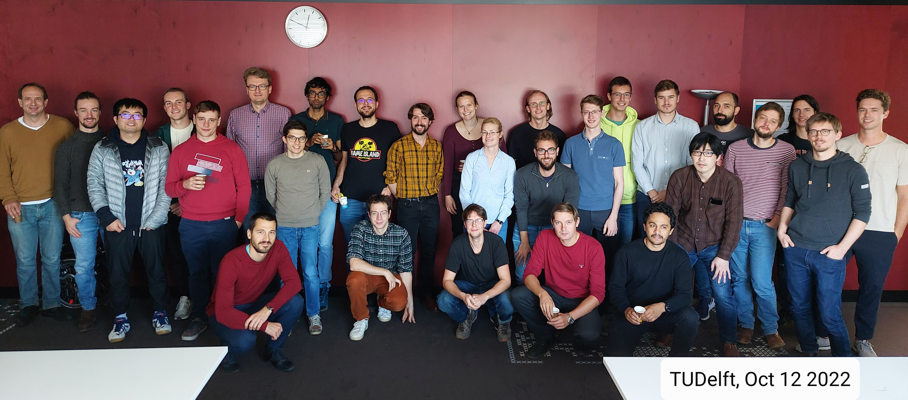

Delft Many-Body Workshop Series
===============================

Understanding collective phenomena in strongly correlated quantum many-body systems is one of the biggest challenges in modern condensed matter physics. Development of efficient computational methods and conformal field theory topped up with the recent progress on cold atoms experiments make the study of low-dimensional strongly correlated systems one of the hottest topics in the field. The goal of this workshop series is to bring together local experts working on various aspects of quantum many-body theory to regenerate the network of scientific connections and to stimulate new collaborations in the area.

### **Tensor Networks for Constrained Systems**

16-18 October 2023

[Network web-site](https://iqtn.phys.strath.ac.uk/tensor-networks-for-constrained-systems/)

**Program**

Monday, 16 October 2023 – 1st day

9:30-10:15
**Fabien Alet**, CNRS, Toulouse

Re-entrance effect in the finite-temperature phase diagram of the quantum dimer model on the square lattice

10:15-11:00
**Maksym Serbyn**

From Quantum Many-body Scars to Optimal Steering and Energy Superdiffusion

11:45-12:30
**Juan P. Garrahan**

Exact dynamics and hydrophobicity in deterministic circuits: classical and quantum Floquet East models

14:00-14:45
**Mari Carmen Banuls**

15:30
**Posters Sesssion & Discussion**

**Participants**

Philippe Corboz; 
Paul Fendley;
Maksym Serbyn;
Felix Flicker;
Juan P Garrahan;
Luca Tagliacozzo;
Roderich Moessner;
Fabien Alet;
Zlatko Papic;
Mari Carmen Banuls;
Jeanne Colbois;
Frederico Carollo;
Kareljan Schoutens;
J-S Caux;
Dirk Schuricht;
Shobna Singh;
Marko Ljubotina; 
Luisa Eck;
Luke Causer;
Alberto Zorzato;
Maria Cea Fernández;
Bowy la Riviere;
Jose Soto Garcia; 
Samuel Nyckees;
Laurens Vanderstraeten; 
Wojciech de Roek;
Miguel Frias;
Andrew Green;
Stijn Kleijweg;
Patrick Emonts;
Alice Barthe;
Yaroslav Herasymenko;
Jiri Minar;
Matthew Steinberg;
Lieuwe Bakker;
Liam Bond;
Rui-Zhen Huang;
Suvendu Barik;
Pietro Richelli

### **Past workshops**

**February 24 2023 at TUDelft: Disorder, entanglement and localization**

Speakers: Wouter Buijsman (BGU);
Dmitry Abanin (Geneva);
Wojciech De Roeck (Leuven);
Jiri Minar (Amsterdam);
Rui-Zhen Huang (Ghent);
Ward Vleeshouwers (QuiX, QuSoft)

**October 13 2022 at UGhent: Symmetry and Duality in Quantum Many-Body Systems**

List of speakers: Ian McCulloch (Queensland);
Karel Van Acoleyen (Ghent);
Jean-Sébastien Caux (Amsterdam);
Clement Delcamp (Ghent);
Natalia Chepiga (Delft);
Juan Arias (Amsterdam)

**October 12 2022 at TUDelft: Symmetry and Duality in Quantum Many-Body Systems**

List of speakers: Kareljan Schoutens (Amsterdam); 
Hosho Katsura (Tokyo);
Frank Verstraete (Ghent);
Jutho Haegeman (Ghent);
Pieter Claeys(Dresden);
Emanuele Di Salvo (Utrecht);

**June 2nd 2022 at TUDelft**

Speakers: Vladimir Gritsev (UvA); Dirk Schuricht (UU); Sander Otte (TUDelft); Jiri Minar (UvA); Denise Ahmed-Braun (TUE); Lieuwe Bakker (UvA); Jyong-Hao Chen (Leiden); 

**May 31st 2022 at TUDelft**

Speakers: Philippe Corboz (UvA); Jordi Tura Bruguez (Leiden); Lars Fritz (UU); Juraj Hasik (UvA); Maarten Van Damme (UGent); Boris Ponsioen (UvA)

**May 25th 2022 at TUDelft**

Speakers: Kareljan Schoutens (UvA, QuSoft); Laurens Vanderstraeten (UGent); Lieven Vandersypen (TUDelft); Mikael Fremling (UU); Misha Isachenkov (UvA); Onno Huijgen (Radboud)

[Download programs](https://nchepiga.github.io/homepage/assets/program_workshops.pdf)

### **Photo gallery**

### **Location**

**Delft University of Technology**

Room: F 461.1/2 

Kavli Institute of Nanoscience,  **Applied Sciences 22**,

Lorentzweg 1, 2628 CJ Delft,  The Netherlands

