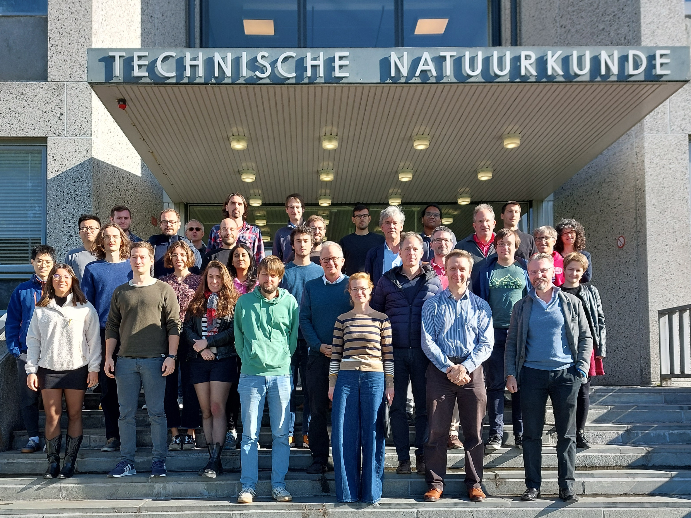

Delft Many-Body Workshop Series
===============================

Understanding collective phenomena in strongly correlated quantum many-body systems is one of the biggest challenges in modern condensed matter physics. Development of efficient computational methods and conformal field theory topped up with the recent progress on cold atoms experiments make the study of low-dimensional strongly correlated systems one of the hottest topics in the field. The goal of this workshop series is to bring together local experts working on various aspects of quantum many-body theory to regenerate the network of scientific connections and to stimulate new collaborations in the area.

### **Non-equilibrium phenomena**

April 14 2025 at TUDelft.

Registration is [open](https://forms.gle/juZnFWnCj1n1XePH8) 

Speakers: 

Vladimir Gritsev (UvA)

Jacopo de Nardis (Cergy)

Tim Taminiau (Delft)

Jose Soto Garcia (Delft)

...

This workshop is supported by NWO.

### **Past workshops**

**4 December 2024, TUDelft: Quantum Field Theory and Boundary Critical Phenomena**
Speakers:
Edmond Orignac (Lyon), Atsushi Ueda (Ghent), Hong-Hao Tu (LMU), Francesco Parisen Toldin (Aachen), Rembert Duine (Utrecht), Emanuele Di Salvo (Utrecht), Tong Liu (LMU),  Vladimir Bashmakov (Nijmegen).
This workshop has been supported by NWO.

**2 October 2024, TUDelft: Quantum Magnetism**
Speakers:
Paul McClarty(CNRS & LLB CEA/CNRS); Alexander Khajetoorians(Radboud); Andrew Green(UCL);
Sander Otte(Delft); Juraj Hasik(Zurich); Bowy La Riviere(Delft).

This workshop has been supported by NWO.

**16-18 October 2023, TUDelft: Tensor Networks for Constrained Systems**
Speakers:
Fabien Alet(CNRS, Toulouse); Zlatko Papic (Leeds);
Juan P. Garrahan (Nottingham); Mari Carmen Banuls (MPQ); Paul Fendley (Oxford);
Kareljan Schoutens (UvA); Roderich Moessner (MPI PKS); Luca Tagliacozzo (Madrid);
Laurens Vanderstraeten (Ghent); Federico Carollo (Tuebingen); Philippe Corboz (UvA);
Felix Flicker (Cardiff);  Jeanne Colbois (CNRS, Toulouse)

This workshop has been supported by [IQTN/EPSRC](https://iqtn.phys.strath.ac.uk/tensor-networks-for-constrained-systems/)

**February 24 2023 at TUDelft: Disorder, entanglement and localization**

Speakers: Wouter Buijsman (BGU);
Dmitry Abanin (Geneva);
Wojciech De Roeck (Leuven);
Jiri Minar (Amsterdam);
Rui-Zhen Huang (Ghent);
Ward Vleeshouwers (QuiX, QuSoft)

**October 13 2022 at UGhent: Symmetry and Duality in Quantum Many-Body Systems**

List of speakers: Ian McCulloch (Queensland);
Karel Van Acoleyen (Ghent);
Jean-Sébastien Caux (Amsterdam);
Clement Delcamp (Ghent);
Natalia Chepiga (Delft);
Juan Arias (Amsterdam)

**October 12 2022 at TUDelft: Symmetry and Duality in Quantum Many-Body Systems**

List of speakers: Kareljan Schoutens (Amsterdam); 
Hosho Katsura (Tokyo);
Frank Verstraete (Ghent);
Jutho Haegeman (Ghent);
Pieter Claeys(Dresden);
Emanuele Di Salvo (Utrecht);

**June 2nd 2022 at TUDelft**

Speakers: Vladimir Gritsev (UvA); Dirk Schuricht (UU); Sander Otte (TUDelft); Jiri Minar (UvA); Denise Ahmed-Braun (TUE); Lieuwe Bakker (UvA); Jyong-Hao Chen (Leiden); 

**May 31st 2022 at TUDelft**

Speakers: Philippe Corboz (UvA); Jordi Tura Bruguez (Leiden); Lars Fritz (UU); Juraj Hasik (UvA); Maarten Van Damme (UGent); Boris Ponsioen (UvA)

**May 25th 2022 at TUDelft**

Speakers: Kareljan Schoutens (UvA, QuSoft); Laurens Vanderstraeten (UGent); Lieven Vandersypen (TUDelft); Mikael Fremling (UU); Misha Isachenkov (UvA); Onno Huijgen (Radboud)

[Download programs](https://nchepiga.github.io/homepage/assets/program_workshops.pdf)

### **Photo gallery**

### **Location**

**Delft University of Technology**

Room: F 461.1/2 

Kavli Institute of Nanoscience,  **Applied Sciences 22**,

Lorentzweg 1, 2628 CJ Delft,  The Netherlands

